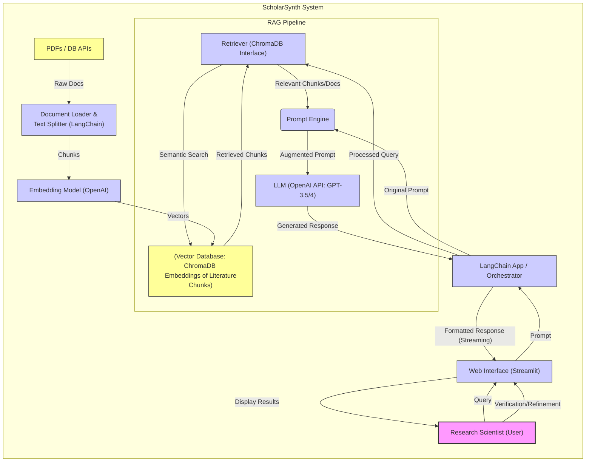

# Assignment Submission: GenAI Assistance for Research Literature Reviews

- **Student:** [Tom Mathews]
- **Chosen Job Role:** Research Scientist (Academic/Industrial)
- **Specific Task:** Conducting a comprehensive literature review for a new research project or proposal.
- **GenAI Solution:** ScholarSynth (Conceptual Design & Implemented Prototype)

## 1. Introduction

This document outlines the conceptual design, architecture, and implementation considerations for **ScholarSynth**, a Generative AI (GenAI) powered assistant designed to help Research Scientists with the demanding task of conducting comprehensive literature reviews. The analysis details the extent of GenAI assistance, the chosen technical approach (Retrieval-Augmented Generation - RAG), potential challenges, and presents illustrative examples based on a prototype implementation available at [https://github.com/Mathews-Tom/ScholarSynth](https://github.com/Mathews-Tom/ScholarSynth).

## 2. Knowledge Base (KB) and Sample Queries

### 2.1. Knowledge Base (KB) Definition and Format

- **Content:** The KB for ScholarSynth comprises the vast and ever-growing body of scholarly literature relevant to the researcher's field. This includes peer-reviewed journal articles, conference papers, pre-prints (e.g., from arXiv), patents, and potentially relevant theses or technical reports.
- **Source:** Access is assumed via academic database APIs (e.g., PubMed, Scopus, IEEE Xplore, Semantic Scholar), institutional repositories, or local collections of downloaded papers (e.g., PDFs).
- **Format Assumptions:** The RAG system is designed to handle textual data.
  - **Structured Metadata:** Standard bibliographic information (Title, Authors, Abstract, Journal, Year, Keywords, DOI) is assumed to be available, often retrieved via APIs.
  - **Full Text:** Ideally, full-text documents (primarily PDFs or extracted text) are processed. The system parses these documents, splits them into manageable chunks (e.g., paragraphs or sections), and converts them into vector embeddings for efficient retrieval.
  - **Data Preparation:** A crucial step involves ingesting the literature, extracting text, cleaning it (removing headers/footers if needed), chunking it appropriately, and generating embeddings using a suitable model (e.g., OpenAI `text-embedding-ada-002`), which are then stored in a vector database (ChromaDB in the implementation).

### 2.2. Sample Queries

The system is designed to answer natural language queries researchers might pose during a literature review. Examples include:

- **Summarization:** "Summarize the key findings, methodology, and limitations of the attached paper [or paper matching DOI XXXXX]."
- **Thematic Analysis:** "Based on the 15 papers I've uploaded related to 'remote work and mental well-being (2020-2023)', what are the recurring themes about factors impacting employee well-being?"
- **Gap Identification:** "Analyze these recent articles on [specific topic]. Are there any commonly cited limitations or unanswered questions that suggest areas for future research?"
- **Methodology Comparison:** "Compare the methodologies used in Smith et al. (2021) and Chen & Li (2022) to study remote work challenges."
- **Finding Specific Information:** "Which papers in my collection discuss the impact of 'Zoom fatigue' on employee burnout?"

## 3. GenAI Assistance Level & Justification

### Level of Assistance: Mostly (80% or more)

#### Justification

GenAI, particularly using the RAG approach implemented in ScholarSynth, can automate or significantly accelerate many *time-consuming* but *mechanically intensive* aspects of a literature review.

### What GenAI CAN Do Effectively:**

- **Broad Searching & Screening:** Formulate search queries, interface with databases, rapidly screen thousands of titles/abstracts for relevance based on semantic similarity, reducing the initial pool significantly.
- **Document Management:** Detect duplicates, organize retrieved papers.
- **Summarization:** Generate concise summaries of abstracts or full papers, extracting key information (objectives, methods, findings).
- **Initial Theme/Concept Identification:** Analyze a corpus of papers to identify dominant themes, keywords, and basic relationships (e.g., citation links, co-occurrence of concepts).
- **Information Extraction:** Pull specific data points (e.g., sample sizes, reported metrics) into structured formats.
- **Drafting Assistance:** Generate initial draft paragraphs or sections based on synthesized information from provided sources, which the researcher can then refine.

**What GenAI CANNOT Do (or Does Poorly):**

- **Deep Critical Appraisal:** Cannot reliably assess the methodological rigor, validity of arguments, or the true significance of a study's conclusions within the broader scientific context. It lacks genuine scientific judgment.
- **Nuanced Synthesis:** Struggles to weave together disparate or conflicting findings into a coherent, insightful narrative that explains *why* discrepancies exist or what the deeper implications are.
- **Identification of Subtle Gaps:** May miss implicit assumptions, unexplored nuances, or truly novel connections that require deep domain expertise and critical thinking.
- **Formulating Original Arguments:** Cannot construct a truly original argument or perspective based on the literature; it primarily rearranges and summarizes existing information.
- **Ensuring Intellectual Honesty:** Cannot take responsibility for the final interpretation, potential biases, or the overall integrity of the review.

**Conclusion on Assistance:** GenAI handles a large portion (estimated ≈80%) of the *effort/time* associated with finding, filtering, and initially processing literature. However, the remaining ≈20% performed by the human researcher (critical evaluation, deep synthesis, narrative construction, ensuring accuracy) constitutes the most crucial part for producing a high-quality, insightful, and original literature review.

## 4. Proposed GenAI Solution: ScholarSynth

### 4.1. Approach: Retrieval-Augmented Generation (RAG) with Smart Prompting

This approach is chosen because:

- **Grounding & Accuracy:** RAG directly addresses the hallucination problem of standalone LLMs by forcing the model to base its answers on specific, retrieved textual evidence from the KB (the scholarly literature). This is essential for factual accuracy in research.
- **Relevance & Timeliness:** RAG allows the system to use the most current literature ingested into the vector store, rather than relying solely on the LLM's potentially outdated training data.
- **Contextualization:** By feeding relevant document chunks into the prompt, the LLM gains specific context for the task at hand.
- **Efficiency:** Leverages powerful pre-trained foundation models (like GPT-3.5/4) via prompting, avoiding the immense cost and complexity of training a domain-specific model from scratch. Fine-tuning might be useful for very niche domains but offers diminishing returns compared to effective RAG for broader reviews.

### 4.2. Architecture and Core Components

The high-level architecture follows the RAG pattern previously described in the project's conceptual documentation and implemented in the GitHub repository:

#### Core Components Used in Implementation

- **Orchestration:** LangChain (Python library) to structure the RAG pipeline, manage prompts, interact with components, and handle conversational memory. *Justification:* Provides modularity, pre-built components for RAG, and simplifies complex chain creation.
- **LLM:** OpenAI `gpt-3.5-turbo` or `gpt-4` via API. *Justification:* State-of-the-art language understanding and generation capabilities, widely accessible.
- **Vector Database:** ChromaDB. *Justification:* Open-source, easy to set up locally for development/prototyping, integrates well with LangChain. For production, scalable alternatives exist.
- **Embedding Model:** OpenAI `text-embedding-ada-002`. *Justification:* Good performance, cost-effective, integrates natively with OpenAI LLMs and LangChain.
- **Frontend (Optional but implemented):** Streamlit. *Justification:* Rapidly build interactive web applications for demonstrating the system.

#### 4.3. Workflow

1. **KB Ingestion (Offline):** Relevant documents (PDFs etc.) are loaded, parsed, split into chunks, embedded using OpenAI, and stored in ChromaDB.
2. **User Query:** Researcher inputs a query via the UI (e.g., Streamlit).
3. **Retrieval:** The query is embedded, and ChromaDB is searched for relevant document chunks using semantic similarity (or MMR for diversity). The Parent Document Retriever technique (if enabled) fetches corresponding larger context chunks.
4. **Context Augmentation:** Relevant retrieved chunks/documents are combined with the original query and system instructions (e.g., "Answer based *only* on the provided context") into an augmented prompt.
5. **Generation:** The augmented prompt is sent to the OpenAI LLM.
6. **Response:** The LLM generates a response grounded in the provided context. LangChain handles streaming the response back to the UI.
7. **Presentation:** The UI displays the response, often with links/references back to the source document chunks used, allowing for verification.
8. **Iteration:** The researcher evaluates the response, potentially refines the query or asks follow-up questions leveraging conversation history.

## 5. Prompts and RAG Effectiveness Enhancement

### 5.1. Prompt Engineering

Effective prompts are crucial for guiding the LLM. Key elements include:

- **Role Definition:** "You are an AI assistant helping a Research Scientist conduct a literature review."
- **Context Grounding:** "Based *only* on the following provided document snippets..."
- **Task Specificity:** Clearly define the task (e.g., "Summarize the key findings," "Identify recurring themes," "List methodological limitations").
- **Output Format:** Specify desired output (e.g., "Provide a bulleted list," "Write a concise paragraph," "Generate a table comparing...").
- **Constraints:** "Keep the summary under 100 words," "Focus on aspects relevant to mental well-being."

*(Concrete prompt structures are illustrated in the Appendix associated with the project's conceptual design.)*

### 5.2. RAG Effectiveness Enhancements Implemented/Considered

- **Chunking Strategy:** Experimenting with chunk size and overlap is important. Smaller chunks can improve retrieval precision, but larger chunks provide more context. The implementation uses standard recursive character splitting.
- **Parent Document Retriever (Implemented):** As previously described, this technique retrieves smaller, precise chunks for similarity matching but provides the larger parent chunks containing them to the LLM. This balances precision and context, improving response quality.
- **Retrieval Parameters (Implemented & Configurable):**
  - `k`: Number of chunks to retrieve (user-configurable). Tuning `k` balances context breadth vs. noise.
  - `Search Type`: Option between standard Similarity Search and Maximal Marginal Relevance (MMR) to increase diversity in retrieved documents, reducing redundancy.
- **Metadata Filtering (Potential Enhancement):** Allowing users to pre-filter the search space based on publication year, journal, or keywords before the vector search.
- **Re-ranking (Potential Enhancement):** Using a more sophisticated model (like a cross-encoder) to re-rank the initially retrieved documents before passing them to the LLM.

## 6. Implementation Efforts (ScholarSynth Prototype)

A prototype demonstrating the core RAG functionality has been implemented and is available on GitHub: [https://github.com/Mathews-Tom/ScholarSynth](https://github.com/Mathews-Tom/ScholarSynth).

#### Key Features Implemented

- **Document Ingestion:** Script to load PDFs, chunk text, generate embeddings (OpenAI), and store in ChromaDB.
- **RAG Pipeline:** LangChain implementation using OpenAI LLM and ChromaDB retriever.
- **Configurable Retrieval:** UI options to select retriever type (Standard vs. Parent Document), adjust `k`, and choose search type (Similarity/MMR).
- **Interactive Web UI:** Streamlit application for user interaction.
- **Streaming Responses:** Real-time feedback as the LLM generates tokens.
- **Conversation History:** Session-based memory for follow-up questions.
- **Source Exploration:** Displaying metadata and snippets of source documents used for generation, enabling verification.
- **Basic Error Handling:** Mechanisms to manage potential issues like API timeouts or configuration errors.

**Show the Streamlit UI - overall layout, input box, chat history area**

## 7. Potential Problems, Limitations, and Risks

Reliance on GenAI like ScholarSynth introduces challenges:

- **Accuracy & Hallucination:** While RAG mitigates this, the LLM can still misinterpret context or subtly hallucinate. **Requires constant human verification.**
- **Quality of KB:** The system's effectiveness depends entirely on the quality and comprehensiveness of the ingested literature. Gaps in the KB lead to incomplete reviews.
- **Critical Depth:** Risk of producing superficial reviews if the researcher over-relies on AI summaries without deep reading and critical evaluation.
- **Bias:** GenAI can inherit and potentially amplify biases present in the training data or the literature itself.
- **Data Privacy/Security:** Using proprietary or pre-publication research ideas as queries in systems using third-party APIs (like OpenAI) poses confidentiality risks. Careful consideration of data handling is needed (e.g., using on-premise models or Azure OpenAI with stricter data policies).
- **Deskilling:** Over-reliance may hinder researchers' development of core literature review skills.
- **Plagiarism:** AI-generated text must be significantly rewritten and properly attributed to avoid academic misconduct. It's a tool for assistance, not replacement.
- **TCO (Total Cost of Ownership):**
  - **API Costs:** Significant costs for LLM calls (e.g., OpenAI per-token pricing) and embedding generation, especially with large document sets and frequent use.
  - **Infrastructure:** Costs for hosting (if deploying beyond local), vector database management, potential database API access fees.
  - **Maintenance:** Ongoing effort to keep the KB updated (re-indexing), manage dependencies, and potentially fine-tune components.
- **Response Time (Latency):** The RAG process involves multiple steps (embedding query, vector search, LLM call), which introduces latency. Complex queries or large context windows increase response time. Streaming helps *perceived* latency but not total time.
- **Scalability:** Performance might degrade with extremely large KBs or high concurrent user loads, potentially bottlenecking at the vector database or LLM API rate limits.

## 8. Conclusion

Generative AI, specifically through Retrieval-Augmented Generation as implemented in the ScholarSynth concept, offers significant potential to assist Research Scientists, automating **mostly (≈80%)** of the laborious aspects of literature reviews. By handling searching, screening, summarizing, and initial theme identification, it frees up researchers to focus on the irreplaceable human tasks of critical appraisal, deep synthesis, nuanced interpretation, and original thought generation.

The ScholarSynth prototype demonstrates the feasibility of building such a tool using readily available components like LangChain, OpenAI, and ChromaDB. Enhancements like the Parent Document Retriever and configurable settings improve usability and output quality. However, awareness of limitations regarding accuracy, depth, bias, cost, and latency is crucial. GenAI should be viewed as a powerful co-pilot, not an autopilot. Its responsible and effective use requires continuous human oversight, critical evaluation, and integration into, rather than replacement of, established research workflows and scholarly judgment.
