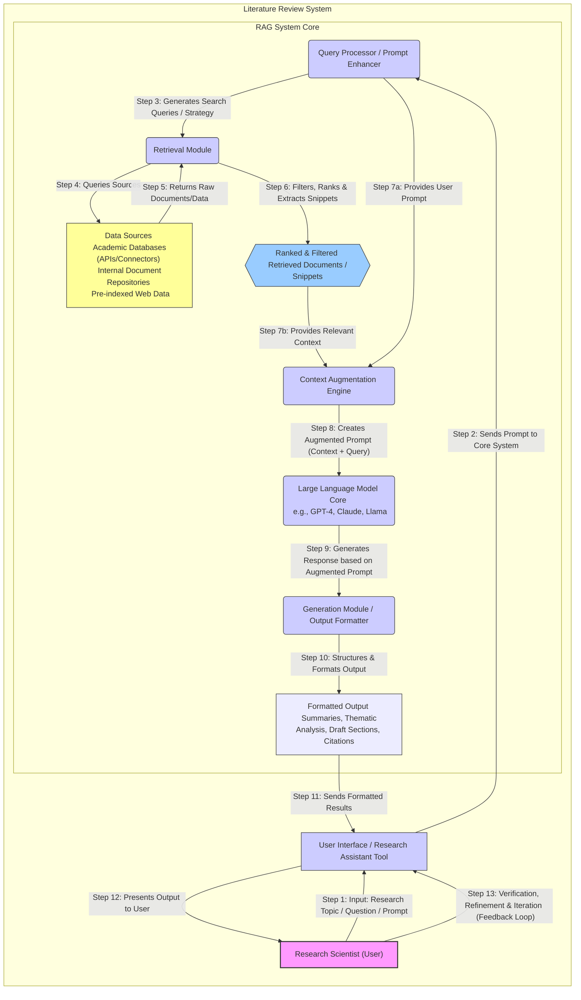

# ScholarSynth: An AI-Powered Assistant for Synthesizing Research Literature

- **Job Role:** Research Scientist (Academic/Industrial)
- **Specific Task:** Conducting a comprehensive literature review for a new research project or proposal.
- **Document Objective:** To provide a thorough analysis of the extent to which Generative AI (GenAI) can assist a Research Scientist with the task of conducting a literature review, detailing the capabilities, limitations, recommended implementation approaches, and potential challenges, going beyond the basic requirements to offer deeper insights.

---

## Understanding the Problem Statement (The Literature Review Task)

### Deep Understanding of the Task

Conducting a comprehensive literature review is a foundational, non-trivial task in research. It's far more than just collecting papers. The core objectives are:

- **Situating New Research:** Understanding the existing body of knowledge (theories, findings, methodologies) to identify where a new research project fits, what unique contribution it aims to make, and how it builds upon or challenges prior work.
- **Identifying Knowledge Gaps:** Pinpointing specific unanswered questions, unexplored areas, methodological limitations, or conflicting findings in the current literature that the new research can address.
- **Methodological Guidance:** Learning from the methodologies (both successful and flawed) employed in previous studies relevant to the topic.
- **Avoiding Redundancy:** Ensuring the proposed research doesn't simply duplicate efforts already completed and published.
- **Building a Theoretical Framework:** Synthesizing existing theories and findings to establish a conceptual or theoretical basis for the new study.
- **Demonstrating Expertise:** Showing funding bodies or academic peers a thorough grasp of the relevant field.

### Key Aspects & Complexities

The task involves several interconnected activities:

- Defining the scope and boundaries of the review.
- Developing effective search strategies across multiple databases and sources.
- Screening potentially thousands of titles and abstracts for relevance.
- Retrieving and managing full-text documents.
- Reading and critically evaluating selected papers for quality, relevance, methodology, and findings.
- Synthesizing information across numerous sources, identifying themes, patterns, contradictions, and evolutionary trends in the research area.
- Structuring and writing the review logically and coherently, often as part of a larger proposal, thesis, or publication.
- Accurate citation management.

### Requirements for Success

A successful literature review requires domain expertise, critical thinking skills, analytical ability, patience, meticulous organization, and strong academic writing skills. It is iterative; initial findings often refine the search scope and research questions.

---

## GenAI's Interaction with the 'Data' (Literature): Processing and Analysis Capabilities

In this context, the "data" is the vast corpus of existing scholarly literature (papers, articles, patents, etc.). GenAI's role involves processing and analyzing this data.

### 'Data' Acquisition and Preprocessing (GenAI-assisted)

- **Search Strategy Enhancement:** GenAI can brainstorm keywords, suggest related concepts, and even help formulate complex Boolean queries for academic databases based on natural language descriptions of the research topic.
- **Automated Searching:** Tools leveraging GenAI can interface with APIs of databases (PubMed, Scopus, IEEE Xplore, arXiv etc.) or use web scraping techniques (where permissible) to perform broad searches more efficiently than manual methods.
- **Initial Screening & Filtering:** GenAI models can rapidly screen titles and abstracts based on relevance criteria defined by the researcher (using techniques like semantic similarity or classification models fine-tuned on relevance), drastically reducing the number of papers requiring manual review. This acts like an initial "cleaning" step, removing irrelevant "noise."
- **Duplicate Detection:** Identifying and flagging duplicate entries retrieved from different databases.

### Feature Engineering & Analysis (GenAI-assisted)

- **Summarization (Feature Extraction):** Generating concise summaries of abstracts or even full papers, extracting key information like objectives, methodology, key findings, and limitations. This is akin to extracting relevant "features" from each document.
- **Theme/Topic Modeling:** Analyzing a collection of relevant papers to automatically identify and cluster dominant research themes, concepts, or emerging trends without prior definition (e.g., using techniques related to Latent Dirichlet Allocation (LDA) or modern embedding clustering).
- **Concept Mapping & Relationship Identification:** Identifying connections between papers, authors, or concepts (e.g., citation links, shared methodologies, opposing viewpoints). Tools like Connected Papers or ResearchRabbit leverage graph-based approaches, often enhanced by AI.
- **Information Extraction:** Pulling specific pieces of information from papers (e.g., sample sizes, specific statistical results, reported limitations) into structured formats (like tables).
- **Handling Missing Values/Outliers (Conceptual Analogy):** While not direct numerical data handling, GenAI can help identify *gaps* in the literature (areas with few studies) or *outlier* papers (those with highly contradictory findings) that warrant specific attention.

### Insightful Analysis Potential

GenAI excels at processing information at a scale impossible for humans. It can reveal broad patterns, quickly summarize large volumes of text, and identify explicit connections. This provides a powerful starting point and overview for the researcher.

### Limitations in Analysis

GenAI's analysis is primarily pattern-based and lacks true comprehension. It struggles with:

- **Critical Appraisal:** Cannot reliably judge the *quality* or *validity* of a study's methodology or conclusions.
- **Nuanced Interpretation:** May miss subtle arguments, implicit assumptions, or the deeper significance of findings within the field's context.
- **Synthesizing Conflicting Data:** Can list contradictory findings but struggles to provide a deep, interpretive synthesis explaining *why* they might conflict or what the overall implication is.

---

## GenAI Approach: Selection and Justification (Building/Using the Solution)

### Selected Approach

**Primarily Smart Prompting combined with Retrieval-Augmented Generation (RAG); potential for Fine-tuning in specialized contexts.**

### Justification

- **Smart Prompting:** Foundational LLMs (like GPT-4, Claude 3, Gemini Advanced) possess broad world knowledge and strong language skills suitable for brainstorming, summarizing, and drafting. Effective prompting is crucial to guide the AI towards the specific needs of the literature review (scope, desired output format, level of detail).
- **Retrieval-Augmented Generation (RAG):** This is critical for literature reviews. LLMs alone can hallucinate or rely on outdated information. RAG grounds the GenAI's responses in specific, up-to-date documents retrieved from reliable academic sources.
  - *Process:* The system takes the researcher's query -> Searches relevant academic databases (via API or integrated tools) -> Retrieves relevant papers/abstracts -> Feeds these documents into the LLM context -> Prompts the LLM to perform tasks (summarize, synthesize, identify themes) *based only on the provided documents*.
  - *Benefits:* Dramatically improves factual accuracy, reduces hallucination, provides direct citation links, and ensures the review is based on current literature. Many modern AI research assistant tools (Elicit, Scite, Consensus) are built on this principle.
- **Fine-tuning:** Less critical for general literature reviews but potentially valuable for highly specialized fields. Fine-tuning a model on a large corpus of papers and reviews from a narrow domain (e.g., specific subfield of genomics, materials science) could improve its understanding of niche terminology, common methodologies, and relevant theoretical frameworks within that field. However, it's resource-intensive and may not offer significant advantages over well-executed RAG for broader reviews.
- **From Scratch:** Impractical and unnecessary. Building a foundation model capable of this requires immense resources. Leveraging existing models via prompting and RAG is the most efficient and effective path.

### Advanced RAG Techniques Implemented

- **Parent Document Retriever:** Our implementation uses an advanced RAG technique that retrieves smaller, more focused chunks for precise matching but provides the LLM with the larger parent document they came from for better context. This approach helps solve the common RAG tradeoff between retrieval precision and context richness.
  - *Small Chunks for Retrieval:* Using smaller chunks (e.g., 500 characters) allows for more precise matching to the user's query.
  - *Large Parent Documents for Context:* Instead of just returning the small chunks, the system provides the larger parent documents (e.g., 2000 characters) that contain those chunks, giving the LLM more context to work with.
  - *Implementation:* The system maintains both a vector store for the small chunks and a document store for the parent documents, with references connecting them.

### Implementation Considerations

- Requires access to academic databases (potentially via institutional subscriptions or APIs).
- Needs user proficiency in prompt engineering and critically evaluating AI outputs.
- Integration into existing workflows (e.g., reference managers like Zotero, EndNote) is desirable.

### Enhanced User Experience Features

- **Streaming Responses:** The system delivers LLM responses token by token in real-time, providing immediate feedback and a more engaging user experience compared to waiting for complete responses.
- **Conversation History:** The application maintains a session-based conversation history, allowing users to refer back to previous questions and answers, and enabling more natural follow-up questions.
- **Interactive Source Exploration:** Users can explore the source documents that inform the AI's responses through an interactive interface that displays document metadata, content snippets, and references.
- **Configurable Retrieval Settings:** Users can customize their experience by adjusting retrieval parameters such as:
  - *Retriever Type:* Choose between standard retrieval or the advanced Parent Document Retriever.
  - *Number of chunks (k):* Control how many document chunks are retrieved for each query.
  - *Search Type:* Select between similarity search or Maximal Marginal Relevance (MMR) for more diverse results.

Figure below illustrates the typical architecture of such a RAG system designed to assist with literature reviews:



---

## Output Presentation, Synthesis, and Reporting: GenAI vs. Human

### GenAI Output Presentation

- **Format:** GenAI can generate structured summaries, bulleted lists of themes, draft paragraphs or sections of the review, tables comparing studies, and citation lists.
- **Strengths:** Speed, scalability (processing many papers), consistency in format, identification of explicit themes and connections.
- **Weaknesses:** Outputs can be generic, lack a critical voice, may contain inaccuracies/hallucinations, struggle with nuanced synthesis, and fail to capture the 'story' or argument of the literature. Citation formatting might require correction.

### Human Synthesis and Reporting

- **Process:** Involves deep reading, critical thinking, comparing and contrasting findings, evaluating methodologies, identifying subtle connections and gaps, constructing a logical narrative argument, and overlaying domain expertise and interpretation.
- **Strengths:** Critical appraisal, nuanced interpretation, ability to synthesize conflicting information insightfully, identify implicit gaps, formulate original arguments, ensure methodological rigor, take ownership of the narrative and conclusions.
- **Weaknesses:** Slower process, potential for human bias, limited capacity to process extremely large volumes of literature comprehensively.

### Bridging the Gap

The optimal workflow involves using GenAI for the heavy lifting and the human researcher for higher-order thinking:

- **GenAI:** Search, screen, summarize individual papers, identify initial themes, provide first drafts.
- **Human:** Verify AI outputs, critically appraise selected papers, perform deep synthesis, interpret findings, identify subtle gaps, structure the narrative, write the final review ensuring originality and critical depth.

### Degree of Assistance Evaluation: **Mostly (80% or more)**

GenAI can automate or significantly assist with a large proportion of the *time-consuming* aspects (searching, filtering, summarizing). This frees the researcher to focus on the *intellectually demanding* aspects (critical appraisal, synthesis, interpretation). While GenAI handles ≈80% of the mechanical work, the remaining ≈20% of human effort represents the most critical value-add in terms of research quality and originality.

### Potential Problems & Risks (Reiteration & Emphasis)

- **Accuracy & Hallucination:** Paramount risk requiring meticulous human verification.
- **Critical Depth:** Over-reliance leads to superficial reviews lacking genuine insight.
- **Bias:** AI may perpetuate biases in literature or search algorithms.
- **Deskilling:** Researchers may lose proficiency in foundational review skills.
- **Plagiarism:** Using AI output without significant rewriting and proper attribution.
- **Data Privacy:** Concerns if confidential pre-publication research ideas are used as prompts in public tools.

---

## Conclusion

Generative AI, particularly when implemented using a Retrieval-Augmented Generation (RAG) approach, offers a powerful toolkit to significantly augment and accelerate the literature review process for Research Scientists. It can handle much of the laborious searching, filtering, and summarization involved (**Mostly, 80%+ assistance** on the overall task duration/effort).

The ScholarSynth implementation demonstrates how advanced RAG techniques like the Parent Document Retriever can enhance the quality of AI-generated responses by providing better context while maintaining precise retrieval. The user experience improvements—streaming responses, conversation history, and interactive source exploration—make the system more engaging, intuitive, and transparent, addressing key concerns about AI-assisted research such as citation verification and context understanding. Additionally, the robust error handling mechanisms ensure that the system remains reliable even when facing API connection issues, rate limits, or other potential failures, providing clear feedback to users and gracefully recovering from errors.

However, GenAI cannot replace the essential human elements of deep critical appraisal, nuanced synthesis, identification of subtle knowledge gaps, and the formulation of original insights based on the review. The final output's quality, integrity, and intellectual contribution remain dependent on the researcher's expertise and critical engagement. Successful integration requires viewing GenAI as an advanced assistant, demanding careful validation and thoughtful incorporation into the research workflow, rather than a complete replacement for human intellect and judgment.

---

Okay, here is an Appendix illustrating how GenAI (specifically using a Retrieval-Augmented Generation - RAG approach) might be used for the "Research Scientist" task of conducting a literature review, along with examples of how human refinement adds critical value.

---

## Appendix: Illustrative Examples of GenAI Assistance in Literature Review

**Scenario:** A Research Scientist is beginning a literature review on the **impact of remote work arrangements on employee mental well-being**, focusing on studies published between 2020 and 2023. They have used database searches (potentially AI-assisted) to retrieve a set of 15 relevant peer-reviewed articles.

---

### Example 1: Summarizing Retrieved Articles using RAG

**Researcher's Goal:** Quickly understand the key findings of a subset of the retrieved papers.

**Sample Prompt to RAG-enabled GenAI tool:**

```plaintext
Context: You have access to the full text of the following three articles retrieved for my literature review on remote work and mental well-being (2020-2023):
[Document 1: "Smith et al. (2021) - The Double-Edged Sword: Autonomy and Isolation in Remote Work"]
[Document 2: "Chen & Li (2022) - Burnout and Blurring Boundaries: Mental Health Challenges in Mandatory Remote Work"]
[Document 3: "Garcia & Jones (2023) - Supporting Well-being in Hybrid Work Models: The Role of Managerial Support"]

Task: Please provide a concise summary (approx. 100 words each) for each article, focusing on:
1. The main research question or objective.
2. Key findings regarding mental well-being (positive and/or negative impacts).
3. The primary contributing factors identified (e.g., autonomy, isolation, boundaries, support).
```

**Simulated GenAI (RAG-based) Output:**

```text
Here are the summaries based on the provided articles:

**1. Smith et al. (2021):** This study investigated how increased autonomy and potential isolation associated with remote work impact employee well-being. Key findings indicate that while autonomy positively correlates with job satisfaction and lower stress, increased isolation is a significant predictor of depressive symptoms and reduced team cohesion. The balance between autonomy and connectedness was identified as crucial for well-being in remote settings.

**2. Chen & Li (2022):** Focusing on employees shifted to mandatory remote work during the pandemic, this research explored drivers of burnout and mental health challenges. It found significantly higher rates of reported burnout compared to pre-pandemic levels, primarily linked to blurred work-life boundaries, increased virtual meeting fatigue ('Zoom fatigue'), and difficulties disconnecting after work hours. Lack of adequate home office setups was also a contributing factor.

**3. Garcia & Jones (2023):** This study examined factors supporting mental well-being within hybrid work models. The findings highlight the critical role of proactive managerial support, including regular check-ins, clear communication of expectations, and flexibility regarding work schedules. Employees reporting higher levels of manager support showed significantly better mental well-being outcomes (lower stress, higher engagement) compared to those with less support, regardless of the number of days worked remotely.
```

---

### Example 2: Identifying Themes Across Articles

**Researcher's Goal:** Identify recurring concepts or themes across the initial set of articles to structure the literature review.

**Sample Prompt to RAG-enabled GenAI tool:**

```plaintext
Context: Based on the summaries and full text of the three articles provided previously (Smith et al., 2021; Chen & Li, 2022; Garcia & Jones, 2023) concerning remote/hybrid work and mental well-being.

Task: Identify and list the major recurring themes or factors discussed across these studies regarding their impact (positive or negative) on employee mental well-being. Provide a brief description for each theme, referencing which papers discussed it.
```

**Simulated GenAI (RAG-based) Output:**

```plaintext
Based on the provided articles, here are the major recurring themes impacting employee mental well-being in remote/hybrid work:

1.  **Autonomy vs. Isolation:** Remote work offers increased autonomy, which can be positive (Smith et al.). However, it also risks social and professional isolation, negatively impacting well-being (Smith et al.).
2.  **Work-Life Boundaries:** Difficulty in establishing and maintaining boundaries between work and personal life is a significant challenge, contributing to burnout and stress (Chen & Li).
3.  **Managerial Support:** The level and quality of support from managers play a critical role in mitigating negative impacts and promoting well-being, particularly in hybrid models (Garcia & Jones).
4.  **Communication & Connection:** The nature of communication (e.g., virtual meeting fatigue - Chen & Li) and the sense of connection to colleagues (related to isolation - Smith et al.) are key factors.
5.  **Work Environment:** Factors like adequate home office setups (Chen & Li) influence the remote work experience and associated stress.
```

---

### Example 3: Human Refinement and Synthesis

**Researcher's Goal:** Integrate the AI-generated summaries and themes into a coherent paragraph for the literature review, adding critical analysis and synthesis.

**Note:** Researcher starts with AI Output mentally or pasted into a document.

**Human Researcher's Refined Paragraph (incorporating insights from AI output but adding depth):**

> The transition towards remote and hybrid work models since 2020 has presented a complex picture regarding employee mental well-being, as highlighted by recent literature. While some studies emphasize the benefits of increased autonomy afforded by remote work, potentially leading to greater job satisfaction (Smith et al., 2021), this autonomy is often counterbalanced by significant risks. A major recurring theme is the challenge of social and professional isolation, identified as a key predictor of negative mental health outcomes like depressive symptoms (Smith et al., 2021). Furthermore, the shift, particularly when mandatory, exacerbated difficulties in maintaining work-life boundaries, leading to increased burnout fueled by factors such as virtual meeting fatigue and an inability to mentally disconnect from work (Chen & Li, 2022). Critically, the effectiveness of these new work models in supporting well-being appears heavily contingent on organizational factors. Garcia & Jones (2023) found that proactive and empathetic managerial support is pivotal in mitigating stress and fostering engagement within hybrid arrangements, suggesting that organizational culture and management practices are key mediating variables determining whether remote/hybrid work ultimately enhances or detracts from employee mental well-being. Further research should explore the interplay of these factors across different industries and job roles.

**Analysis of Human Value-Add:**

- **Flow and Narrative:** The human researcher creates a smooth narrative flow, connecting the different findings logically rather than just listing them.
- **Critical Language:** Uses more nuanced and critical language ("complex picture," "counterbalanced by significant risks," "heavily contingent," "key mediating variables").
- **Synthesis:** Doesn't just list themes but synthesizes them (e.g., connecting autonomy risks to isolation, linking boundary issues to burnout drivers).
- **Emphasis:** Strategically emphasizes key findings (e.g., the critical role of managerial support).
- **Interpretation:** Draws broader conclusions and suggests future research directions based on the synthesis, demonstrating deeper understanding.
- **Citation Integration:** Integrates citations smoothly within the text.
